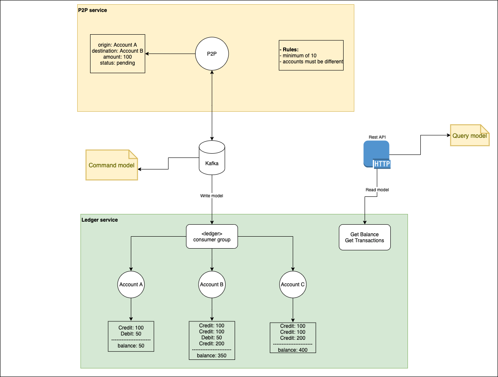

# Microservice reactive bank

Project to learn and put in practice some concepts such as the actors model, CQRS and asynchronous microservices by simulating a bank account which users can transfer money through P2P transactions.

## Architecture & technical details
* * *

Experimented technologies

- Akka
- Scala
- Kafka

### Service communication
* * *
The main objective is that all write messages exchanged by every microservice must be asynchronous. 

The Kafka is used to make asynchronous communication possible and create an agnostic layer to isolate the technology chosen for each microservice from the external world.

### Services
* * * 

#### Ledger
* * *

The ledger was written using the actors mode in order to simplify the concurrent model. That means every account is an actor who knows how to
change your mutable state in a thread-safe way.

## Contribution guidelines
* * *

* Write unit test for each actor message
* Write integration test for each exposed API endpoint
* Scala 2.13 best practices  
* Reactive principles
* Be asynchronous
